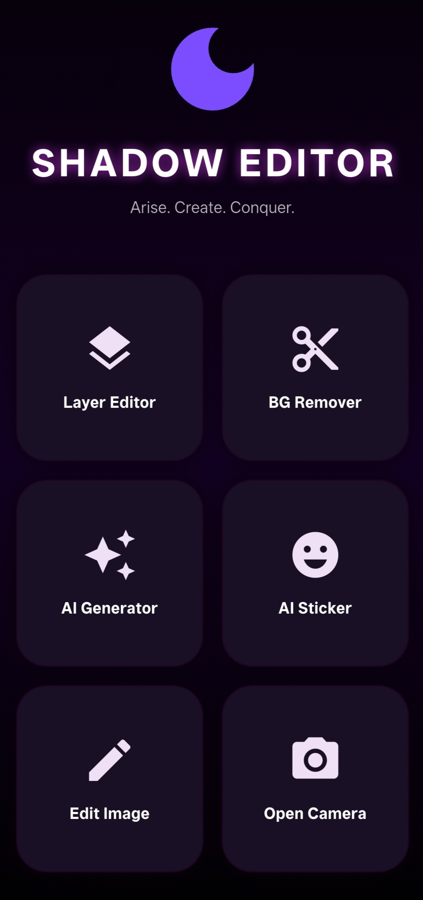
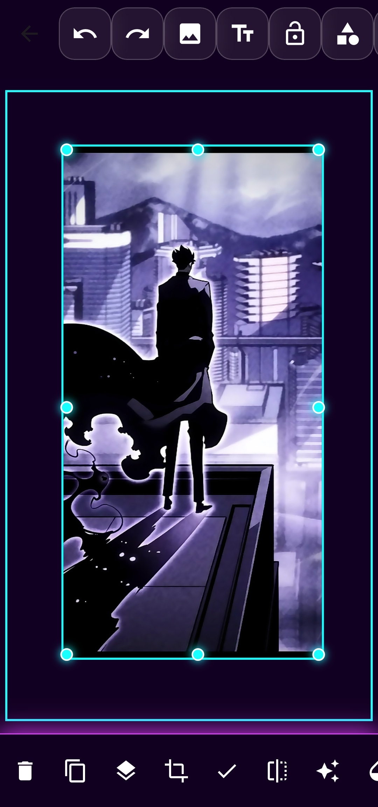
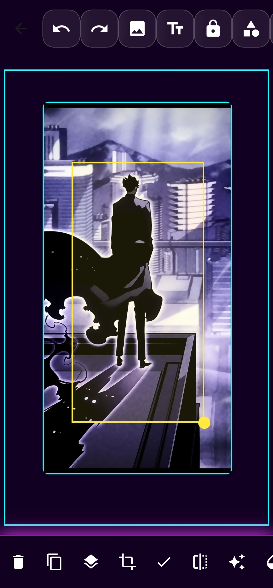
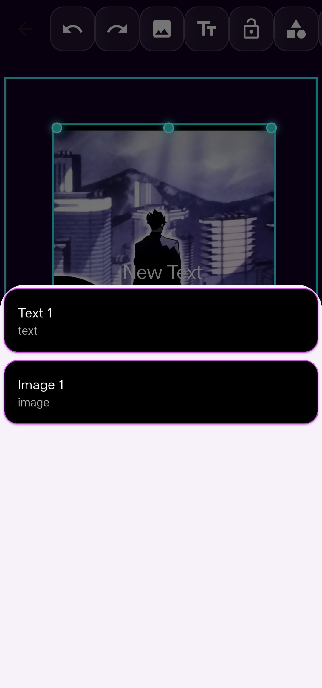

# 🚀 Shadow Editor

A professional Flutter-based image editing application built using Dart and Flutter.

## ✨ Features

* Multi Layer Editing System
* Drag, Resize, Rotate & Scale Objects
* Layer Lock Support
* Bring To Front / Bring To Back
* Duplicate Layers
* Advanced Text Editing
* Text Gradients & Effects
* Glow, Shadow & Stroke Effects
* Image Filters
* Real Crop Tool
* AI Background Remover
* AI Image Generator
* AI Sticker Generator
* Undo / Redo System
* Shape Layers
* Save & Share Images

## 📸 Screenshots

### Home Screen

### Main Editor

### Crop Tool

### Layers Panel

## 🛠 Technologies Used

* Flutter
* Dart
* ONNX Runtime
* Image Processing
* AI Models
* State Management

## 🚀 Upcoming Features

* HD Upscale
* Magic Eraser
* Manual Background Remover

## 👨‍💻 Developer

Shivaraj

Cybersecurity Enthusiast | Developer | Networking Learner
